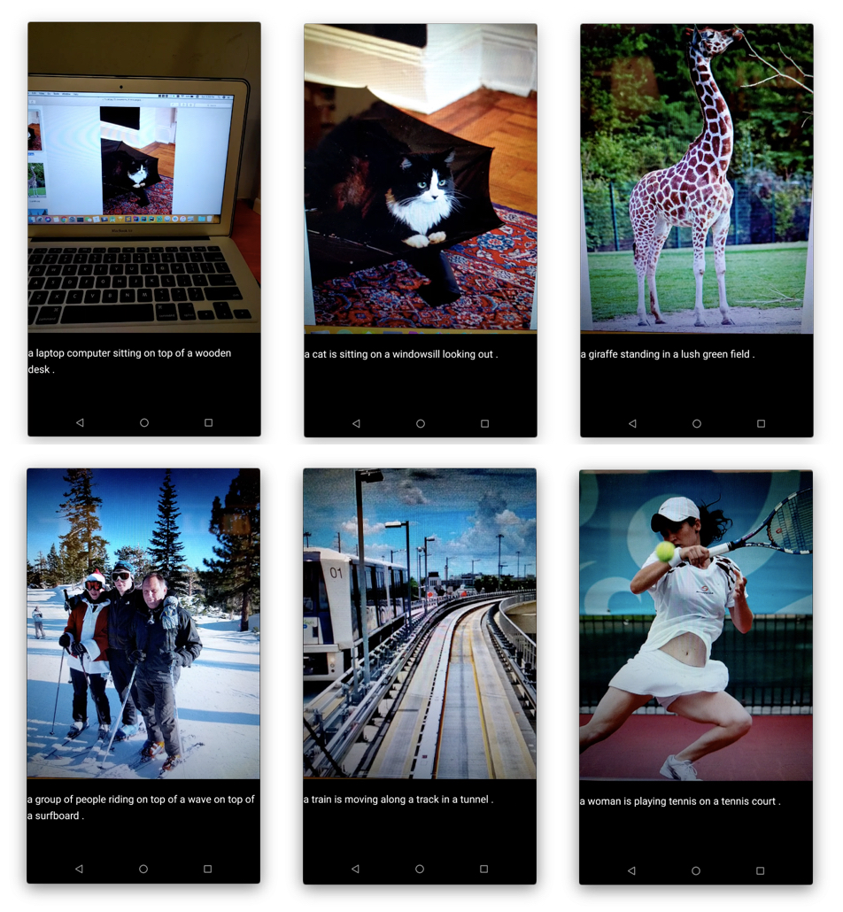
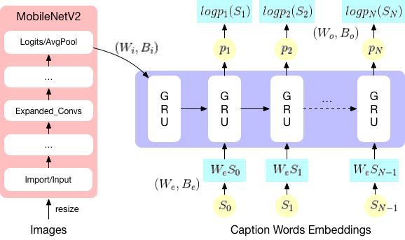
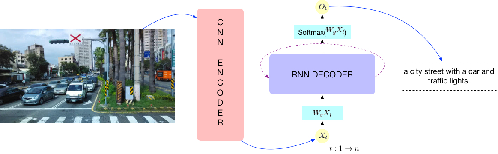

## image2caption



The live demo video is available at the [demo.mp4](demo/demo.mp4)

## Traning



```bash
python main.py --mode train --caption_path ./Dataset/captions_train2014.json --feature_path ./Dataset/features.npy --data_is_coco
```

## Inference



```bash
python main.py --mode test --inception_path ConvNets/mobilenet_v2.pb --image_path Images/library.jpg 
```

## Generate Model

```bash
python main.py --mode test --image_path ./Images/street.jpg --inception_path ./ConvNets/mobilenet_v2.pb --saveencoder --savedecoder

cd utils
python save_graph.py --mode encoder --model_folder ../model/Encoder/
python save_graph.py --mode decoder --model_folder ../model/Decoder/

# generate .pb
python merge_graphs.py --encpb ../model/Trained_Graphs/encoder_frozen_model.pb --decpb ../model/Trained_Graphs/decoder_frozen_model.pb

cd model/Trained_Graphs/
# generate .tflite
tflite_convert \
  --output_file=./merged_frozen_graph.tflite \
  --graph_def_file=./merged_frozen_graph.pb \
  --input_arrays=encoder/import/input \
  --input_shapes=1,224,224,3 \
  --output_arrays=decoder/LSTM/word_0,decoder/LSTM/word_1,decoder/LSTM/word_2,decoder/LSTM/word_3,decoder/LSTM/word_4,decoder/LSTM/word_5,decoder/LSTM/word_6,decoder/LSTM/word_7,decoder/LSTM/word_8,decoder/LSTM/word_9,decoder/LSTM/word_10,decoder/LSTM/word_11,decoder/LSTM/word_12,decoder/LSTM/word_13,decoder/LSTM/word_14,decoder/LSTM/word_15,decoder/LSTM/word_16,decoder/LSTM/word_17,decoder/LSTM/word_18,decoder/LSTM/word_19,decoder/LSTM/word_20,decoder/LSTM/word_21
```

## References

* [neural-nuts/image-caption-generator](https://github.com/neural-nuts/image-caption-generator)
* [Cam2Caption](https://github.com/neural-nuts/Cam2Caption)
